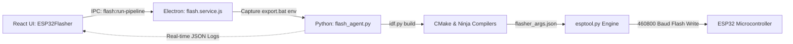

# InnoIDE Desktop Application

[](https://www.electronjs.org/)
[](https://reactjs.org/)
[](https://vitejs.dev/)
[](https://chakra-ui.com/)
[](https://docs.espressif.com/projects/esp-idf/)
[](#)

**InnoIDE** is an integrated development desktop environment tailored for IoT, embedded systems, and microcontroller firmware programming. It bridges visual block programming, circuit simulation, code editing, and direct-to-hardware flashing for Espressif microcontrollers (ESP32, ESP32-S2, ESP32-S3, ESP32-C3, ESP32-C6, and ESP8266).

---

## 🌟 Key Features

### 1. Dual Development Paradigm
- **Visual Block Programming & Flowcharts**: Drag-and-drop node-based logic generation, sequence diagrams, and block-based hardware control.
- **Embedded C/C++ Code Editor**: Monaco-powered code editor with syntax highlighting, IntelliSense, auto-completion, and multi-tab workspace management.

### 2. Zero-Configuration ESP32 Flashing Pipeline
- **Auto-Detection**: Dynamically detects ESP-IDF installations (`C:\Espressif\frameworks\esp-idf-v5.x`) and captures the build environment via `export.bat` without manual PATH configuration.
- **Automatic Port Discovery & Auto-Refresh**: Background COM port scanner detects connected microcontrollers every 3 seconds, filters out virtual/Bluetooth modems, and handles plug/unplug events dynamically.
- **High-Speed Flashing (460,800 Baud)**: Uses direct `esptool.py` memory writes driven by `flasher_args.json` offsets, bypassing CMake toolchain overhead.
- **Dual-Stage Recovery Engine**: Automatic fallback to 115,200 baud with manual bootloader mode instructions if USB-CDC auto-reset times out.
- **Port Conflict Guard**: Automatically disconnects active serial monitor sessions before flashing to prevent `Access Denied (COM Busy)` locks on Windows.

### 3. Companion App Builder
- Visual mobile mockup designer to bind hardware pins and telemetry to interactive UI widgets (Switches, Gauges, Sliders, Action Buttons) for quick IoT dashboard prototyping.

### 4. Simulation & Diagnostics
- Integrated circuit simulation, rule engine validation, mathematical scratchpad, and terminal log stream.

---

## 🏗️ System Architecture

```
inno-ide-desktopapp/
├── electron/                   # Electron desktop layer
│   ├── ipc/                    # IPC handlers (flash, serial, filesystem, process)
│   ├── services/               # Background services (flash.service.js, serial.service.js)
│   ├── main.js                 # Electron main window lifecycle
│   └── preload.cjs             # Secure Context Isolation API bridge
├── python/                     # Embedded hardware workers
│   └── flash_agent.py          # ESP-IDF compilation & esptool write pipeline
├── src/                        # React Frontend
│   ├── components/             # UI components (ESP32Flasher, CodeEditor, BlockProgramming)
│   ├── features/               # Workspace features, terminal panel, runtime preview
│   ├── services/               # API clients, GitHub integration, calculator
│   ├── store/                  # Redux Toolkit state slices
│   └── platform/               # IPC abstractions and platform adapters
├── docs/                       # Architectural and feature documentation
├── ESP32_Firmware_Flashing_Pipeline_Report.pdf  # Technical flashing report (PDF)
├── ESP32_Flashing_Pipeline_Report.html          # Technical flashing report (HTML)
└── package.json
```

---

## ⚡ Flashing Subsystem Overview

The flashing pipeline connects the React UI to physical hardware through an isolated multi-process workflow:



### Memory Map & Binary Layout

| Component | Offset | Target File | Purpose |
| :--- | :--- | :--- | :--- |
| **Bootloader** | `0x0` / `0x1000` | `build/bootloader/bootloader.bin` | Hardware initialization & partition loading |
| **Partition Table** | `0x8000` | `build/partition_table/partition-table.bin` | Partition layout (NVS, OTA, Factory app) |
| **Application Firmware**| `0x10000` | `build/ESP32_Firmware_Project.bin` | Compiled user firmware & FreeRTOS tasks |

Detailed technical documentation is available in [ESP32_Firmware_Flashing_Pipeline_Report.pdf](./ESP32_Firmware_Flashing_Pipeline_Report.pdf).

---

## 🚀 Getting Started

### Prerequisites
- **Node.js**: v18.0.0 or higher
- **npm**: v9.0.0 or higher
- **Python**: v3.10+ (for flashing engine)
- **ESP-IDF**: v5.0+ (Optional for local flashing; installer supported)

### Installation

1. **Clone the repository:**
   ```bash
   git clone https://github.com/Dineshkumar-1393-innotrat/inno-ide-desktopapp.git
   cd inno-ide-desktopapp
   ```

2. **Install dependencies:**
   ```bash
   npm install
   ```

3. **Start Development Server (Vite + Electron):**
   ```bash
   npm run electron:dev
   ```

   *Or run Vite web server standalone:*
   ```bash
   npm run dev
   ```

---

## 📦 Build & Packaging

Build production desktop binaries for Windows:

```bash
# Build Vite assets and package Electron executable
npm run dist:win
```

Output installers and portable executables will be generated in `dist-desktop/` and `release/`.

---

## 📋 Available Scripts

| Command | Description |
| :--- | :--- |
| `npm run dev` | Starts the Vite React frontend in development mode |
| `npm run electron:dev` | Launches both Vite and the Electron desktop application concurrently |
| `npm run build` | Compiles the React application into production `dist/` bundle |
| `npm run electron:build` | Compiles frontend assets for Electron distribution |
| `npm run dist:win` | Builds Windows desktop installer (`.exe`) via `electron-builder` |
| `npm run lint` | Runs ESLint syntax verification across the codebase |

---

## 📝 Version History & Contributions

- **InnoIDE V1.9** (Current) — Complete ESP32 flasher integration, dual-stage recovery engine, auto-refresh port scanner, and companion app designer.
- **InnoIDE V1.4** — Project explorer, auto-save integration, and dynamic rule engine.
- **InnoIDE V1.0** — Initial block programming and terminal integration.

---

## 🔒 License & Copyright

Copyright © 2026 **Innotrat Labs**. All rights reserved.
Proprietary software for internal and authorized commercial deployment.
